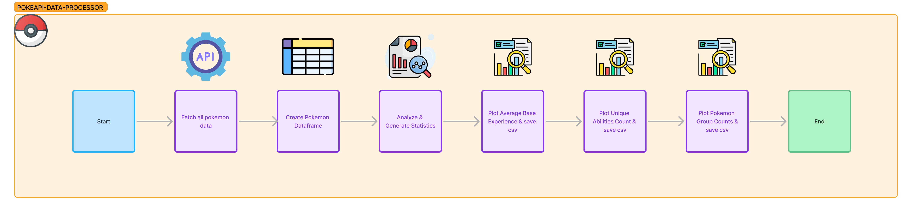

# PokeAPI-Data-Processor

<p align="center">
    
</p>

<h1 align="center">PokeAPI Data Processor - Gather and Analyse Pokemon Data</h1>


# 📚 About

PokeAPI Data Processor is a tool for gathering Pokémon data from the PokeAPI and generating statistical results.

# ⚙️ Functionality

This tool is able to:
- Group Pokémon by their types (e.g., water, fire) and abilities.
- Count the number of Pokémon in each group.
- Calculate the average base experience for each type of Pokémon.
- Calculate the total number of unique abilities for each type of Pokémon.


# 🔧 Installation

  ### Cloning the GitHub Repository

  1. **Clone the Repository:** Open your terminal and run the following command to clone the GitHub repository to your local machine:

      ```bash
      git clone https://github.com/ValdonVitija/PokeAPI-Data-Processor.git
      ```
  2. **Navigate to the Repository:** 
  
      ```bash
      cd PokeAPI-Data-Processor
      ```

# 📋 Usage

### 1. Preparation
1. Create a virtual environment in the root of the project's directory
    ```bash
    python3 -m venv .venv
    ```
2. Active your virtual environment

    ```bash
    source .venv/bin/activate #Linux/Mac based
    ------------------------------------------
    .\.venv\Scripts\activate #Windows based
    ```
3. Install requirements in your virtual environment
    ```bash
    pip3 install -r requirements.txt
    ```
4. Run the app
    ```bash
    python3 -m src.main
    ```
    
    You will see something like this: 
    ```bash
    /> python3 -m src.main
                                _
                    _ __   ___ | | _____ _ __ ___   ___  _ __
                | '_ \ / _ \| |/ / _ \ '_ ` _ \ / _ \| '_ \
                | |_) | (_) |   <  __/ | | | | | (_) | | | |
                | .__/ \___/|_|\_\___|_| |_| |_|\___/|_| |_|
        _       _|_|                                         _
    __| | __ _| |_ __ _   _ __  _ __ ___   ___ ___  ___ ___(_)_ __   __ _
    / _` |/ _` | __/ _` | | '_ \| '__/ _ \ / __/ _ \/ __/ __| | '_ \ / _` |
    | (_| | (_| | || (_| | | |_) | | | (_) | (_|  __/\__ \__ \ | | | | (_| |
    \__,_|\__,_|\__\__,_| | .__/|_|  \___/ \___\___||___/___/_|_| |_|\__, |
                            |_|                                        |___/
                            BY : VALDON VITIJA

    fetching all pokemons: 100%|███████████████████████████████████████████████████████████████████████████| 1302/1302 [00:13<00:00, 95.04pokemon/s]
    creating dataframe for pokemons:  44%|████████████████████████████▋                                     | 567/1302 [02:28<04:45,  2.58pokemon/s]
    ```


# 📁 Directory Structure
```bash
.
├── LICENSE #Software License. 
├── README.md #Contains the projects viewable documentation
├── pokeapi_logo.png #The logo of the project
├── pytest.ini #pytest configuration file.
├── requirements.txt #Contains project dependecies.
├── results #The generated results will be stored here
│   ├── csv
│   │   ├── avg_base_experience.csv
│   │   ├── pokemon_group_counts.csv
│   │   └── unique_abilities_count.csv
│   └── visual
│       ├── avg_base_experience.png
│       ├── pokemon_barplot_interactive.html
│       └── unique_abilities_count.png
├── src #contains the entire source code, modularized into python modules
│   ├── __init__.py #convert directory to a python pacakge
│   ├── api_connector.py #the interface towards the pokeapi
│   ├── data_processing.py #data structuring and processing
│   ├── main.py #the entryo point of execution
│   └── result_exporters.py #saves results into different formats
├── tests #contains unit tests
│   ├── __init__.py #convert directory to a python pacakge
│   ├── conftest.py #generic module that other modules will use 
│   ├── results #saved results for testing purposes
│   │   └── csv
│   │       ├── avg_base_experience.csv
│   │       ├── pokemon_group_counts.csv
│   │       └── unique_abilities_count.csv
│   ├── test_api_connector.py 
│   ├── test_data_processing.py
│   └── test_result_exporters.py
```
# Abstract Execution Flow


<p align="center">
    
</p>

# 📊 Results

### 1 Group Pokémon by their types (e.g., water, fire) and abilities
> [!IMPORTANT]
> It wouldn't be resonable to just print pokemons groups based on type and ability on a graph/plot, because we group
data to apply statistical functions on them and not just group them
and do nothing with such groups.

### 2 Count the number of Pokémon in each group
> [!NOTE]
> The graphical result on this case is an interactive graph. To interact with it open the html file
> in a browser and you will find the plotted graph. Do this after you have cloned the repo locally.

- **Graphical**: [View Interactive Graph](results/visual/pokemon_group_counts.html)
- **CSV**: [View CSV 📄](results/csv/pokemon_group_counts.csv)

### 3 Calculate the average base experience for each type of Pokémon

- **Graphical**: [View Graph](results/visual/avg_base_experience.png)
- **CSV**: [View CSV 📄](results/csv/avg_base_experience.csv)

### 4. Calculate the total number of unique abilities for each type of Pokémon

- **Graphical**: [View Graph](results/visual/unique_abilities_count.png)
- **CSV**: [View CSV 📄](results/csv/unique_abilities_count.csv)